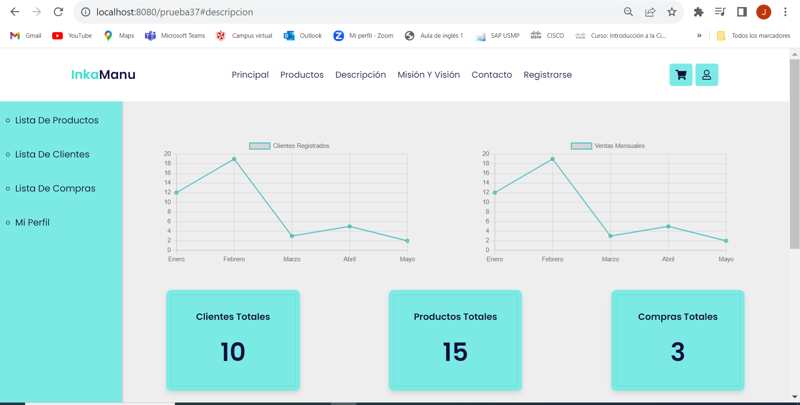
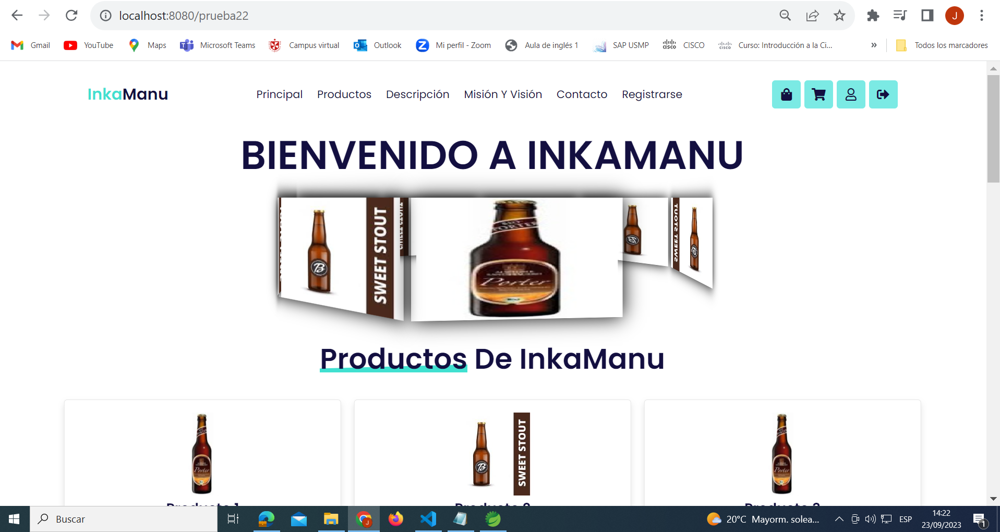
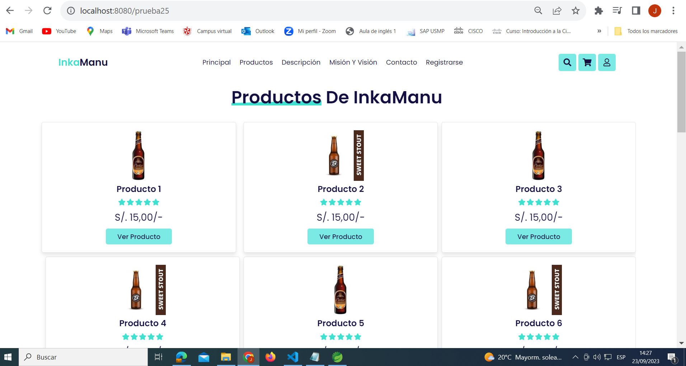
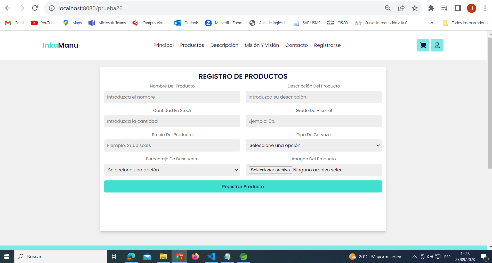
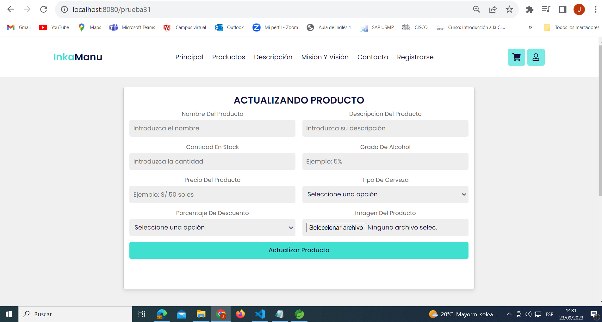
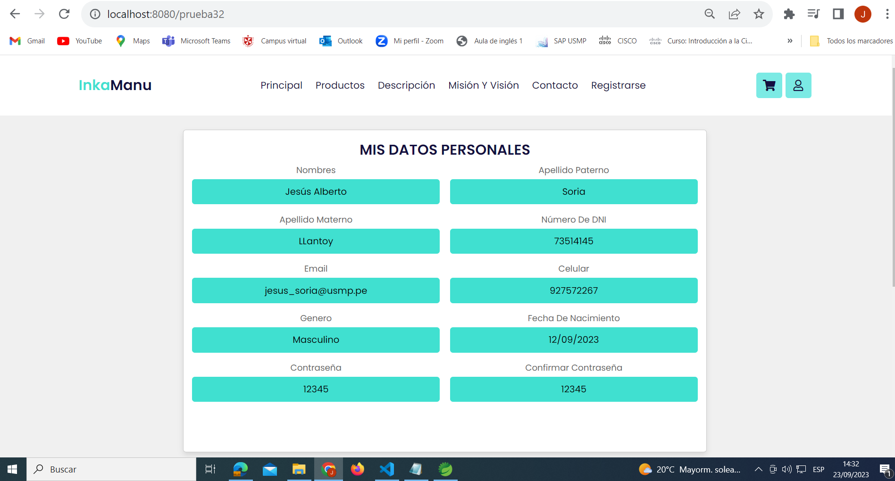
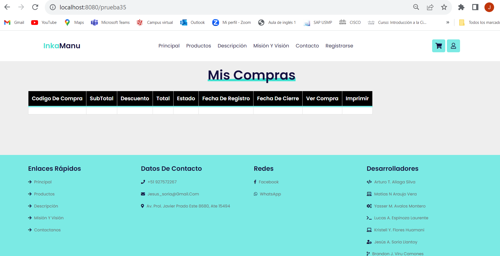
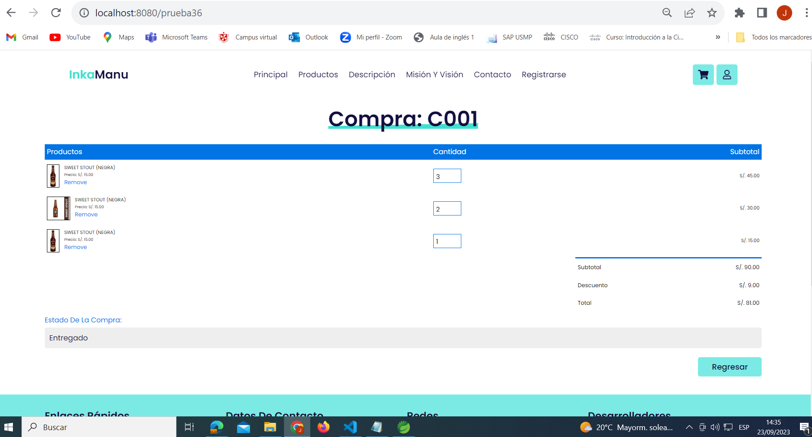
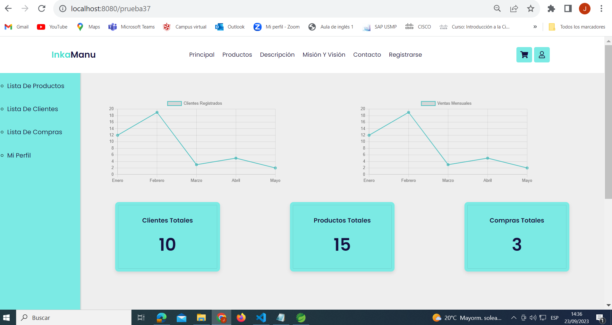

"Agregando el login, registro, carrito, detalle producto, mision, visión, descripcion de la empresa prueba 1 del dia miercoles 13 de setiembre"

AQUI AL EJECUTAR EL PROGRAMA DEBEN DE PONERLE EL NOMBRE DE SU USUARIO Y LA CONTRASEÑA DE SU BASE DE DATOS, IR AL APPLICATION.PROPERTIES Y CAMBIAR ESO, EN MI CASO YO CAMBIE EL USUARIO Y CONTRASEÑA

// Vistas mejoradas del dia 23/09/2023

Realicé una serie de cambios en la página para mejorar su funcionalidad. Agregué todas las vistas principales que son esenciales para el funcionamiento del sitio. Esto incluye la capacidad de listar clientes, productos y compras. Además, implementé una vista que permite cambiar el estado de las compras, lo que facilita la gestión de los pedidos.

Para mejorar la experiencia del cliente, creé una vista que permite a los clientes ver el estado de sus compras y, si lo desean, imprimirlo para su referencia. También diseñé una vista más amplia que presenta todos los productos, lo que hace que la página sea más atractiva y facilita la exploración de productos.

En el área de administración, implementé un registro de clientes que permite al administrador registrar, editar o eliminar cuentas de cliente según sea necesario. Del mismo modo, los productos ahora se pueden registrar, listar y modificar, lo que facilita la gestión del catálogo de productos para los clientes.

// VISTA DEL ADMINISTARDOR 

//VISTA PRINCIPAL PARA EL CLIENTE, NO CLIENTE Y ADMIN
EN ESTA VISTA SE TIENE QUE HACER VALIDACIONES PARA QUE CUANDO EL USUARIO POR EJEMPLO HALLA INICIADO SESIÓN YA NO SE VEA EL REGISTARR NI INICIAR SESIÓN, Y QUE PUEDA VER LA IMAGEN DE CERRAR SESIÓN QUE ES LA IMAGEN QUE
ESTA AL COSTADO DE LA IMAGEN DEL LOGIN, LAS 4 IAMGENES SON UNA DE LA BOLSA DE COMPRA DONDE EL CLIENTE CUANDO ESTE REGISTRADO PODRA VERLA Y ACCEDER A ELLA PARA VER TODAS SUS COMPRAS, EL CARRITO SI ESTARA A LA VISTA PARA CLIENTES Y NO CLIENTES, EL LOGIN SOLO SE PODRA VER CUANDO
NO HALLAS INICIADO SESIÓN, Y LA IMAGEN O ICONO DE CERRAR SESIÓN ES PARA CUANDO EL CLIENTE YA ESTE LOGUEADO

COMO MENCIONE SE TIENE QUE HACER VARIAS VALIDACIONES PARA PODER USAR CORRECTAMENTE LAS VISTAS DE HTML PARA EL RPOYECTO, O DUPLICAR VISTAS SI ES QUE SE COMPLICAN CON LAS VALIDACIONES XDXD

// VISTA DE DETALLE PRODUCTO

// VISTA DEL CARRITO DE COMPRAS

// VISTA DEL CATALOGO DE PRODUCTOS DONDE SE PODRA VISUALIZAR TODOS LOS PRODUCTOS Y HAY UN BUSCADOR PARA QUE EL CLIENTE PUEDA TENER UNA BUENA EXPERIENCIA NAVEGANDO EN NUESTRA PAGINA WEB

// VISTA DEL REGISTRO DE PRODUCTOS PARA EL ADMINISTRADOR

// VISTA DEL LISTAR PRODUCTOS PARA EL ADMINISTRADOR

// VISTA DEL LISTAR CLIENTES PARA EL ADMINISTRADOR

// VISTA DEL REGISTRAR CLIENTES PARA EL ADMINISTRADOR, VIENE DE LA VISTA DE LISTAR CLIENTES, ESA ES LA IDEA

// VISTA DE ACTUALIZANDO MIS DATOS PERSONALES PARA EL LADO DEL CLIENTE

// VISTA DE ACTUALIZANDO LOS DATOS DE UN PRODUCTO PARA EL LADO DEL ADMINISTRADOR

// VISTA DEL PERFIL DEL CLIENTE, LADO DEL CLIENTE

// VISTA LISTAR COMPRAS POR EL LADO DEL ADMINISTRADOR

// VISTA ATENDIENDO UNA COMPRA POR EL LADO DEL ADMINISTRADOR

// VISTA DE MIS COMPRAS PARA EL LADO DEL CLIENTE PARA QUE PUEDA VISUALIZAR TODAS SUS COMPRAS

// VISTA QUE PROVIENE DE LA VISTA DE MIS COMPRAS, AQUI EL CLIENTE PODRA VISUALIZAR SU COMPRA Y LOS DETALLES DE ESA COMPRA, ASI COMO SU EDTADO DE LA COMPRA

// VISTA PRINCIPAL POR EL LADO DEL ADMINISTRADOR, DONDE PODRA IR A LISTAR PRODUCTOS, LISTAR CLIENTES, LISTAR COMPRAS, Y PODRA VISUALIZAR LA CANTIDAD DE CLIENTES, LA CANTIDAD DE PRODUCTOS Y LA CANTIDAD DE COMPRAS, 
ASI MISMO SE PODRA VER DOS GRAFICOS DE LINEA DONDE REPRESENTAN LA CANTIDAD DE CLIENTES Y VENTAS QUE HAY MENSUALMENTE
